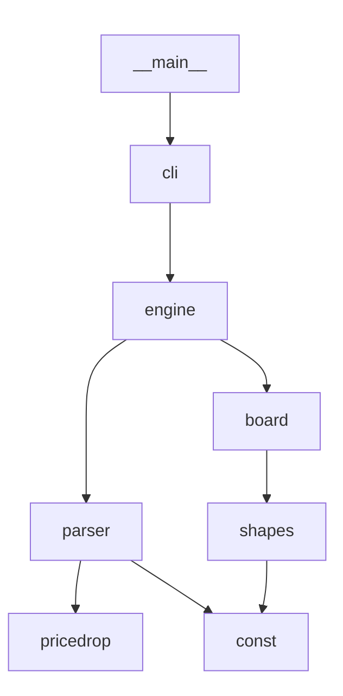
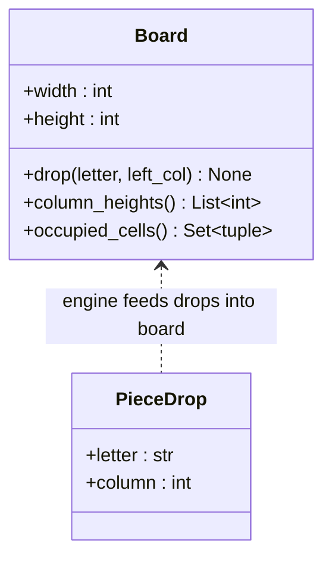

## Architecture

<!-- generated with pyreverse, hand-trimmed for readability -->

```mermaid
flowchart TB
    subgraph entry [" "]
        MAIN[__main__] --> CLI[cli]
    end

    CLI --> ENGINE[engine]
    ENGINE --> PARSER[parser]
    ENGINE --> BOARD[board]
    PARSER --> PD[pricedrop]
    BOARD --> SHAPES[shapes]
    SHAPES --> CONST[const]
    PARSER --> CONST

    style entry fill:none,stroke:none
```

```mermaid
classDiagram
    class Board {
        +width : int
        +height : int
        +drop(letter, left_col) None
        +column_heights() List~int~
        +occupied_cells() Set~tuple~
    }
    class PieceDrop {
        +letter : str
        +column : int
    }
    Board <.. PieceDrop : engine feeds drops into board
```
